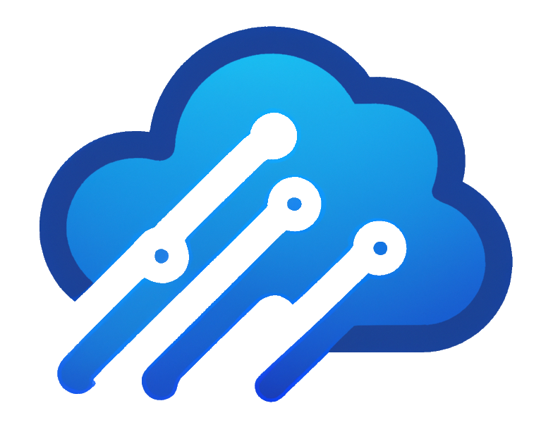

<h1 align="center">
  <br>
  
  <br>
  WiperCheck
  <br>
</h1>
<h4 align="center">An API that analyzes your road trip and returns weather conditions along your journey.</h4>
<br/>

This repo is for the AWS CDK infrastructure of WiperCheck. For the WiperCheck service see [here](https://github.com/evanhutnik/wipercheck-service).


## Infrastructure Overview
The WiperCheck service and loader are both dockerized applications that can be deployed through AWS Elastic Container Service. This repo contains the CDK code for deploying them to AWS.


## Getting Started

### Prerequisites
* Node 16 or later
* AWS CDK v2

### Installation

1. Clone the repo
   ```sh
   git clone https://github.com/evanhutnik/wipercheck-infra.git
   ```
2. Install dependencies
   ```sh
   npm install
   ```
3. Deploy resources
   ```sh
   cdk deploy WipercheckVpcStack
   cdk deploy WipercheckServiceStack
   cdk deploy WipercheckLoaderStack
   ```
4. Start loader EKS service task
   ```sh
   aws ecs create-service \
            --cluster wipercheck-loader-cluster \
            --service-name wipercheck-loader-ecs-service \
            --task-definition wipercheck-loader-task-definition \
            --network-configuration awsvpcConfiguration=\{subnets=\[{VPC subnets}\]\} \
            --launch-type FARGATE \
            --region {region} \
            --desired-count 1 
   ```   

[go-shield]: https://img.shields.io/badge/Go-00ADD8?style=for-the-badge&logo=go&logoColor=white
[go-url]: https://go.dev/
[redis-shield]: https://img.shields.io/badge/redis-%23DD0031.svg?&style=for-the-badge&logo=redis&logoColor=white
[redis-url]: https://redis.io/
[aws-shield]: https://img.shields.io/badge/Amazon_AWS-232F3E?style=for-the-badge&logo=amazon-aws&logoColor=white
[aws-url]: https://aws.amazon.com/

## Acknowledgments
* [DALL-E](https://openai.com/blog/dall-e/) for generating the WiperCheck logo
* [Will](https://github.com/whutchinson98) for helping with the CDK code